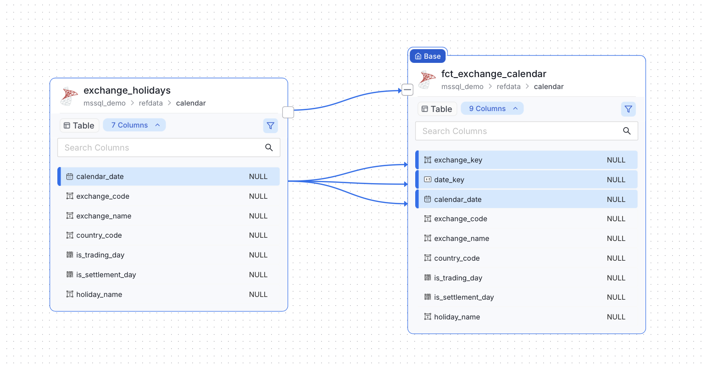

# Column-level lineage from dbt-duckdb to OpenMetadata with OpenLineage

The code for everything below is in this repository; `README.md` has the commands.

We run a dbt-duckdb project in production that never keeps a DuckDB database.
A Kubernetes pod, started by Airflow's `KubernetesPodOperator`, attaches two SQL
Servers with the community `mssql` extension, builds staging and core models in a
local DuckDB file, writes the marts back into SQL Server, and exits. The DuckDB
file is on an `emptyDir` and is deleted with the pod.

The data catalog is OpenMetadata (OM). We wanted OM to show where each mart
column comes from, all the way back to the source tables on the other server.
OM's own dbt integration could not do that for this project. This post describes
what we built instead: a short Python script that posts OpenLineage events
straight to OM, with column lineage derived from the compiled SQL by sqlglot.

Versions used: dbt-core 1.9.10, dbt-duckdb 1.9.4, and OpenMetadata 1.12.6 and
2.0.2. Behaviour described as "measured" was observed against those OM versions.

## Why the dbt agent breaks the graph

OM ingests dbt by reading `manifest.json`, `catalog.json` and `run_results.json`
and matching every node to a table that OM has *already* ingested through one of
its database connectors. Nodes it cannot match are skipped.

DuckDB is not an OM connector. The OM source lists it as "Not supported by
OpenMetadata", and even if it were, there would be nothing to ingest: the
database only exists for the few minutes the pod runs. In our project 10 of 16
dbt nodes live in DuckDB. Every published mart depends only on DuckDB nodes, and
every SQL Server source feeds only DuckDB nodes. The dbt agent drops the middle
layer, so the graph is cut exactly in half. The marts show no upstream, and the
sources show no downstream.

```
source SQL Server        pod-local DuckDB             target SQL Server
crm.dbo.customer   -->   stg_customer  -->  core_*  -->  dw.marts.dim_customer
                         (not a connector, gone after the run)
```

## Why not dbt-ol

The OpenLineage project ships `dbt-ol`, a wrapper that emits events for a dbt
run. It derives a single dataset namespace from the adapter. For dbt-duckdb that
means every dataset, including the attached SQL Server catalogs, gets the DuckDB
namespace. OM then attributes the source tables to the wrong service or fails to
resolve them. Our catalogs sit on three different servers (two SQL Servers and
the pod), so we need to choose the namespace per dataset.

## The OpenLineage endpoint in OpenMetadata

OM accepts OpenLineage run events over HTTP:

```
POST $OM_HOST/api/v1/openlineage/lineage/batch
{"events": [ ... ]}
```

This path does not require the dbt nodes to exist as ingested tables. What it
does need is a way to map an OpenLineage dataset to an OM table. The resolver
(`OpenLineageEntityResolver` in the OM source) does it like this:

1. Split the dataset `name` on `.` and take the last three segments as
   `database.schema.table`.
2. Look up the dataset `namespace` in `namespaceToServiceMapping`
   (Settings → OpenLineage) to find the OM database service.
3. If there is no mapping, fall back to a search on the FQN suffix.

That split is what we need. The namespace names the server, and the name names
the catalog path inside it:

| Namespace | Datasets | OM service |
|---|---|---|
| `mssql://source-sql:1433` | `crm.dbo.customer`, ... | the ingested source SQL Server service |
| `mssql://target-sql:1433` | `dw.marts.dim_customer`, ... | the ingested target SQL Server service |
| `duckdb://my_dbt` | `my_dbt.staging.stg_customer`, ... | a `CustomDatabase` service the script creates |

The script picks the namespace from the dbt node's `database`, which for
dbt-duckdb is the `ATTACH` alias. Simplified:

```python
def namespace_for(database: str) -> str:
    if database == os.getenv("TARGET_DB", "dw"):
        return f"mssql://{os.environ['TARGET_SERVER']}:1433"
    if database in SOURCE_CATALOGS:
        return f"mssql://{os.environ['SOURCE_SERVER']}:1433"
    return os.getenv("OL_DUCKDB_NAMESPACE", "duckdb://my_dbt")
```

Map the two `mssql://` namespaces in OM once. Without the mapping OM falls back to
the suffix search, which usually finds the right table. We did not want to depend
on "usually".

## autoCreateEntities does not work, so create the entities yourself

OM's OpenLineage settings have an `autoCreateEntities` flag, on by default, that
is supposed to create any table an event references. We measured it against OM
1.12.6, and the code is the same in 2.0.1 and 2.0.2. It fails in two ways:

- It never creates the service → database → schema chain. It only creates a
  table inside a schema that already exists, and otherwise logs `Cannot create
  table, schema not found`.
- The table creation itself fails. The resolver calls
  `tableRepository.create(null, newTable)`, and on that path `updatedAt` is never
  set. The insert fails with `null value in column "updatedat" of relation
  "table_entity" violates not-null constraint`, and OM skips the whole event.

So before it posts anything, the script creates every entity the events refer
to, in parent-to-child order: database service, database, schema, table, and a
pipeline entity per dbt model under a `CustomPipeline` service. It is idempotent.
OM answers 409 for an entity that already exists, and the script counts that as
success.

It uses two different HTTP methods, on purpose:

- `PUT` (create or update) for the DuckDB service's tables. We own those, nothing
  else ingests them, and a rerun must be able to correct what the previous run
  wrote.
- `POST` for tables under the SQL Server services. Those are ingested by OM's own
  connectors. A 409 leaves the real metadata alone, where a `PUT` would overwrite
  it with our guesses.

The script never creates the SQL Server services. If one is missing, it logs a
single line naming the environment variable to set, because otherwise every
database, schema and table under that service fails with its own 404 and the log
reads as a dozen unrelated errors.

## Real columns on the DuckDB layer

Column lineage cannot pass through a table that has no columns. In our first
version the DuckDB tables were created with one placeholder column, so every
column path from source to mart stopped at the first DuckDB hop.

The columns now come from `target/catalog.json`. The loader runs `dbt docs
generate` in the same pod, while the DuckDB file still exists, so the catalog
holds the real names and types of every DuckDB node. It has nothing for the SQL
Server nodes. That is fine, because OM's SQL Server connectors ingest those
tables already.

One type mapping needed care. DuckDB's `VARCHAR` is unbounded and reports no
length, but OM rejects `char` and `varchar` columns without a `dataLength`
(HTTP 400, `dataLength must not be null`). The script declares them as
`VARCHAR(MAX)` with length 2^31−1, the same convention SQL Server uses for its
own `varchar(max)`. A real `VARCHAR(50)` keeps its length. Every other type keeps
its DuckDB spelling in `dataTypeDisplay`, so a type that maps to `UNKNOWN` still
shows correctly in the UI.

## Column lineage with sqlglot

OpenLineage carries column lineage in a `columnLineage` facet on the output
dataset: for each output column, the list of input columns it is derived from.
We compute it from `compiled_code` in the manifest, the SQL dbt actually ran,
using sqlglot's `lineage` function with the DuckDB dialect.

sqlglot needs a schema. Almost every staging model starts with `select *`, and
without the columns of the upstream table sqlglot cannot expand the star. Every
column then resolves to `*`, which is useless. The script builds a
`{catalog: {schema: {table: {column: type}}}}` map from two places:

- `catalog.json` for the DuckDB nodes
- OM itself for the attached SQL Server tables
  (`GET /api/v1/tables/name/{fqn}?fields=columns`, cached per table)

Then, for each column of each model:

```python
from sqlglot.lineage import lineage

root = lineage(column, node["compiled_code"], schema=sql_schema, dialect="duckdb")
for leaf in (n for n in root.walk() if not n.downstream):
    src = leaf.source                     # the table sqlglot resolved
    key = (src.catalog.lower(), src.db.lower(), src.name.lower())
    field = leaf.name.rsplit(".", 1)[-1]  # "c.customer_id" -> "customer_id"
    if field != "*" and key in relation_index:
        inputs.append(dataset(relation_index[key]) | {"field": original_case(field)})
```

Two details matter here. sqlglot lowercases identifiers, while dbt renders
relations with their original case (`"CRM"."dbo"."Customer"`), so the lookup from
sqlglot's table back to a dbt node is case-insensitive, and the column name is
restored to its original case from the schema map. OM entity names are
case-sensitive, so `customerid` would not match `CustomerId`.

Column lineage is best-effort. If sqlglot is not installed, the script logs it
and emits table-level lineage. If sqlglot raises on one column (it raises many
different exception types on unusual SQL), that column is skipped and the
table-level edge remains. A failure in column lineage never removes an edge.

The output of one model then looks like this (names shortened):

```json
{
  "eventType": "COMPLETE",
  "eventTime": "2026-09-18T04:12:09.512Z",
  "job": {"namespace": "my_dbt", "name": "model.my_project.dim_customer"},
  "run": {"runId": "..."},
  "inputs": [
    {"namespace": "duckdb://my_dbt", "name": "my_dbt.core.core_customer"}
  ],
  "outputs": [{
    "namespace": "mssql://target-sql:1433",
    "name": "dw.marts.dim_customer",
    "facets": {"columnLineage": {"fields": {
      "customer_key": {
        "inputFields": [{"namespace": "duckdb://my_dbt",
                         "name": "my_dbt.core.core_customer",
                         "field": "customer_id"}],
        "transformationType": "DIRECT"
      }
    }}}
  }]
}
```

The script sends one event per dbt model. A model whose status in
`run_results.json` is an error is sent as `FAIL`. OM's default event filter keeps
only `COMPLETE`, so a failed model is recorded without an edge being drawn for a
table that was never built. Skipped models are not sent.

## Problems we hit

These took the most time to find.

| Symptom | Cause |
|---|---|
| HTTP 200, but the response says `0 successful, N skipped` | OM could not resolve the datasets, almost always because a service, database or schema is missing. The script treats "skipped and nothing successful" as a failure, since the status code alone would let the DAG go green on a run that catalogued nothing. |
| `400 Invalid request format` from OM 2.0.x | `eventTime` with a `+00:00` offset. OM 2.0.2 accepts only the `Z` form of UTC. 1.12.6 accepted both. Python's `isoformat()` produces `+00:00`. |
| `401` on `/api/v1/users/login` with the right password | OM expects the password base64-encoded in that call. |
| `403 [EditLineage] not allowed`, then `403 [Create] not allowed` | A new bot has no roles. It needs `LineageBotRole` for the lineage and `IngestionBotRole` for creating entities. |
| Lookups 404 on a service that exists | OM names are case-sensitive: `MSSQL` and `mssql` are different services. The script corrects a name that differs only in case against the services OM has, and logs which one it used. |
| Columns show as `_unknown` | `catalog.json` was missing. `dbt docs generate` is non-fatal in our loader, and its catalog queries go through the `mssql` extension, which is the least-tested path. |

For authentication in the pod, use a bot JWT mounted from a Kubernetes Secret
(`OM_JWT_TOKEN_FILE`), not an environment variable, which would be visible in
`kubectl describe pod`. A bot token can be issued with `JWTTokenExpiry:
"Unlimited"`. Session tokens from `/users/login` expire within the hour, which is
fine for a laptop and wrong for a nightly DAG.

## Running it

The emitter is one file. Apart from sqlglot it uses only the Python standard
library, so the loader image needed no other packages. It runs after `dbt build`
and `dbt docs generate`:

```bash
dbt build
cp target/run_results.json target/run_results.build.json   # docs generate overwrites it
dbt docs generate
python scripts/emit_openlineage.py
```

The copy of `run_results.json` is needed because `dbt docs generate` replaces it
with the results of its own catalog run, which would lose the model statuses.

To see the events without touching OM:

```bash
OL_DRY_RUN=1 python scripts/emit_openlineage.py | jq '.events[0]'
```

Against a local OM from the official docker compose, the script can log in by
itself:

```bash
OM_HOST=http://localhost:8585 \
OM_USER=admin@open-metadata.org OM_PASSWORD=admin \
TARGET_SERVER=target-sql SOURCE_SERVER=source-sql \
  python scripts/emit_openlineage.py
```

In the loader, any failure of the emitter is logged and ignored. A broken
metadata post should not fail a data load.

## Looking at it in the UI

Open a mart table in OM and go to the Lineage tab. The graph now runs from the
SQL Server source tables, through the DuckDB staging and core tables, to the
mart. Expand the columns to show each
table's columns, then click a column. OM marks the path of that one column
through every hop, including the DuckDB tables that existed for only a few
minutes.



Above, from the dbt project in this repository: a seed table and the mart built from it, both in
SQL Server, with the column edges the emitter posted. Clicking one source column, `calendar_date`,
marks the three mart columns it feeds: the date key, the copy of itself, and `exchange_key`,
a surrogate key that `dbt_utils.generate_surrogate_key` hashes from `calendar_date` and
`exchange_code`. sqlglot worked that out from the compiled SQL; nothing was declared by hand.

You can check the same thing through the API:

```bash
curl -s -H "Authorization: Bearer $TOKEN" \
  "$OM_HOST/api/v1/lineage/table/name/target_service.dw.marts.dim_customer?upstreamDepth=3&downstreamDepth=1" \
  | jq '[.nodes[].type] | group_by(.) | map({(.[0]): length}) | add'
```

## Limits

The column lineage is only as good as sqlglot's reading of the compiled SQL.
Jinja is already resolved in `compiled_code`, so macros are not a problem, but a
statement sqlglot cannot parse gives that model table-level lineage only. Every
column edge is sent as `DIRECT`; the script does not try to tell a straight copy
from an aggregation. Column lineage in OM is table-to-table. Edges to storage
containers (Parquet files in object storage) and API endpoints stay at table
level. And the bootstrap step exists only because `autoCreateEntities` is broken
in the versions we tested. If a later OM release fixes it, the script can run
with `--no-bootstrap`, and the SQL Server side of the bootstrap is already a
no-op when those tables are ingested.


## Authors

- **Vladimir Gribanov** — [github.com/VGSML](https://github.com/VGSML) · [linkedin.com/in/vladimirgribanov](https://www.linkedin.com/in/vladimirgribanov/)
- **Örjan Lundberg** — [github.com/oluies](https://github.com/oluies) · [linkedin.com/in/orjanlundberg](https://www.linkedin.com/in/orjanlundberg/)

Copyright © 2026 Örjan Lundberg. All rights reserved.
